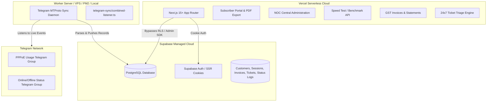

# Safe Vercel Deployment & Production Operations Guide

This guide provides step-by-step instructions to safely deploy the **Spectra Fiber Broadband Customer Portal & NOC Central Operations Hub** to **Vercel** with zero downtime, resilient serverless state management, and reliable database synchronization.

---

## 1. System Architecture



---

## 2. Pre-Deployment: Supabase Database Setup

Before deploying to Vercel, ensure your Supabase database schema is initialized:

1. Log in to [Supabase Dashboard](https://supabase.com/dashboard) and select your project.
2. Navigate to the **SQL Editor** on the left navigation bar.
3. Open the file [`supabase/schema.sql`](file:///c:/Users/arjun/Desktop/New%20folder%20(3)/v5/isp-usage-portal/supabase/schema.sql) from this repository, copy its entire contents, and paste into the Supabase SQL editor.
4. Click **Run**.
5. This creates the required production tables:
   - `public.customers`
   - `public.usage_sessions`
   - `public.invoices`
   - `public.support_tickets`
   - `public.speed_tests`
   - `public.customer_status_logs`
   - `public.telegram_events`

---

## 3. Configuring Supabase Auth Redirect URLs

To allow subscribers and NOC staff to log in, recover passwords, and confirm emails safely from your Vercel deployment:

1. In the Supabase Dashboard, go to **Authentication** -> **URL Configuration**.
2. Set **Site URL** to your production Vercel domain:
   ```
   https://your-project.vercel.app
   ```
   *(or your custom domain, e.g. `https://portal.spectra.net`)*
3. Under **Redirect URLs**, add the wildcard redirect patterns:
   ```
   https://your-project.vercel.app/**
   https://*-your-team.vercel.app/**
   http://localhost:3000/**
   ```
4. Save the changes.

---

## 4. Deploying to Vercel

### Option A: Deploy via GitHub / GitLab / Bitbucket (Recommended)

1. Push your repository to GitHub:
   ```bash
   git add .
   git commit -m "Prepare portal for Vercel production deployment"
   git push origin master
   ```
2. Go to [Vercel Dashboard](https://vercel.com/dashboard) and click **Add New...** -> **Project**.
3. Select your GitHub repository.
4. Set Framework Preset to **Next.js**.
5. Configure the **Environment Variables** (see Section 5 below).
6. Click **Deploy**.

### Option B: Deploy via Vercel CLI

1. Install the Vercel CLI (if not already installed):
   ```bash
   npm i -g vercel
   ```
2. From the project directory, run:
   ```bash
   vercel
   ```
3. Follow the CLI prompts to link to your Vercel team/account.
4. Set production environment variables in the Vercel dashboard or CLI.
5. Deploy to production:
   ```bash
   vercel --prod
   ```

---

## 5. Required Environment Variables on Vercel

Add the following environment variables in the Vercel Project Settings (**Project Settings** -> **Environment Variables**):

| Variable Name | Environment | Required | Description |
| :--- | :--- | :--- | :--- |
| `NEXT_PUBLIC_SUPABASE_URL` | Production, Preview, Dev | **Yes** | Your Supabase Project URL (`https://xyz.supabase.co`) |
| `NEXT_PUBLIC_SUPABASE_PUBLISHABLE_KEY` | Production, Preview, Dev | **Yes** | Your Supabase publishable / anon key |
| `SUPABASE_SERVICE_ROLE_KEY` | Production, Preview, Dev | **Yes** | Elevated service role key (stored securely server-side) |
| `ADMIN_EMAILS` | Production, Preview, Dev | **Yes** | Comma-separated admin emails (e.g. `admin@spectra.co,noc@spectra.co`) |
| `TELEGRAM_BOT_TOKEN` | Production, Preview, Dev | Optional | Telegram Bot API token for dispatching ticket alerts to NOC |
| `TELEGRAM_CHAT_ID` | Production, Preview, Dev | Optional | Telegram Chat ID for NOC ticket notifications |
| `NEXT_PUBLIC_NOC_WHATSAPP_PHONE` | Production, Preview, Dev | Optional | NOC WhatsApp number for instant speedtest escalation |

> [!NOTE]
> `TELEGRAM_API_ID`, `TELEGRAM_API_HASH`, and `TELEGRAM_SESSION` are **NOT** needed on Vercel because the userbot MTProto client runs continuously on your background worker node.

---

## 6. Setting Up the Telegram Background Worker

Because Vercel serverless functions terminate after each HTTP request, the continuous Telegram MTProto listener runs on any persistent machine (local machine, Raspberry Pi, VPS, Railway, Render, or Docker container).

### Running on a VPS / Server with PM2

1. On your VPS or worker machine, clone the repository and create `.env.local` with:
   ```env
   NEXT_PUBLIC_SUPABASE_URL=https://your-project.supabase.co
   SUPABASE_SERVICE_ROLE_KEY=your_service_role_key
   TELEGRAM_API_ID=your_api_id
   TELEGRAM_API_HASH=your_api_hash
   TELEGRAM_SESSION=your_session_string
   TELEGRAM_CHAT_ID=-1003972724689
   TELEGRAM_STATUS_CHAT_ID=-627642374
   ```
2. Install dependencies:
   ```bash
   npm install
   ```
3. Start the combined listener daemon using PM2:
   ```bash
   npm install -g pm2
   pm2 start "npm run telegram:all" --name "spectra-telegram-sync"
   pm2 save
   pm2 startup
   ```

Now, as Telegram messages arrive in your NOC and usage groups, they are automatically parsed and written to the Supabase database in real time, and instantly visible to subscribers and NOC operators on your Vercel deployment!

---

## 7. Verification Checklist

After deploying to Vercel:

- [ ] **Subscriber Login**: Visit `https://your-project.vercel.app/auth/login` and verify login with a subscriber account.
- [ ] **Data Usage Dashboard**: Verify usage graphs, session history, and PDF download work on the main page.
- [ ] **NOC Administration Panel**: Visit `https://your-project.vercel.app/admin` with an authorized admin email and verify subscriber list, invoice generation, ticket management, and speedtest monitoring.
- [ ] **Speed Test Engine**: Go to `/support` and execute a benchmark to confirm download, upload, and latency measurements.
- [ ] **Invoices**: View `/invoices` to confirm GST invoice generation and PDF exports.
